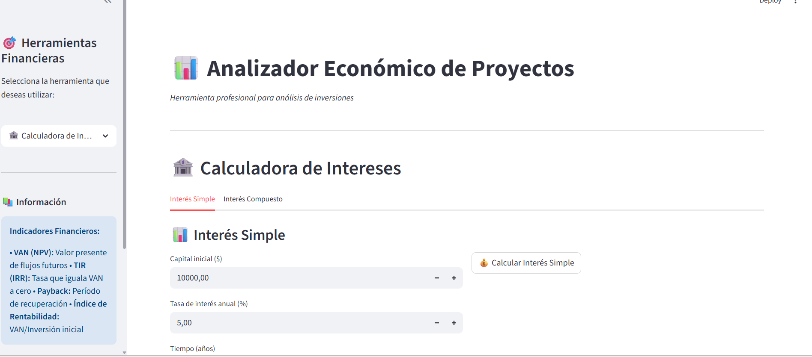
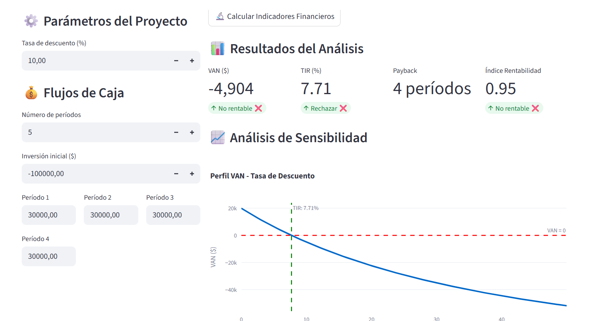
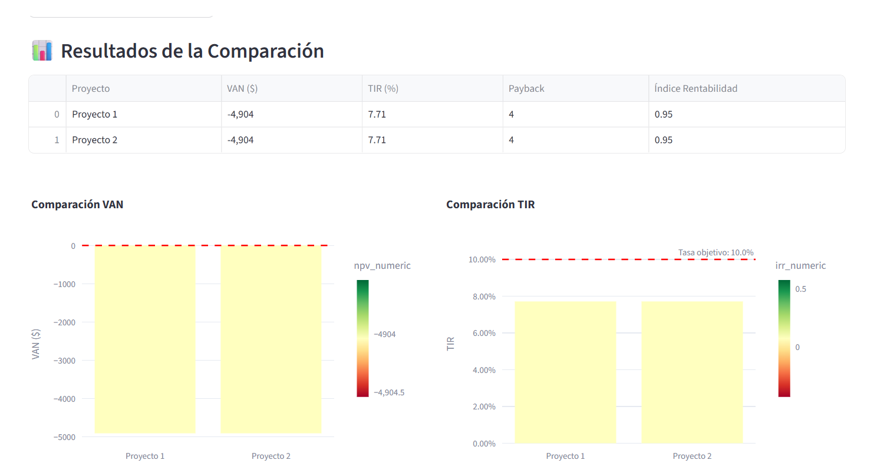

# 📊 Analizador Económico de Proyectos o Investment Project Evaluator

Una aplicación web profesional desarrollada con Streamlit para el análisis financiero integral de proyectos de inversión. Esta herramienta permite evaluar la viabilidad económica de proyectos mediante indicadores financieros clave y análisis avanzados.

## 🚀 Características Principales

### 🏦 Calculadora de Intereses

- **Interés Simple**: Cálculo de rendimientos lineales con visualización gráfica
- **Interés Compuesto**: Análisis de capitalización con diferentes frecuencias
- **Comparación automática** entre ambos métodos

### 📈 Análisis VAN/TIR

- **VAN (Valor Actual Neto)**: Evaluación del valor presente de flujos futuros
- **TIR (Tasa Interna de Retorno)**: Cálculo automático con múltiples algoritmos
- **Período de Recuperación (Payback)**: Tiempo de recuperación de la inversión
- **Índice de Rentabilidad**: Relación beneficio-costo optimizada
- **Análisis de Sensibilidad**: Gráficos interactivos VAN vs. tasa de descuento

### ⏰ Análisis de Momento Óptimo

- **Teoría del Momento Óptimo**: Determinación del tiempo ideal de finalización
- **TIR Marginal vs. Total**: Análisis comparativo de rentabilidades
- **VAN Acumulado**: Evolución del valor por período
- **Recomendaciones Estratégicas**: Basadas en teoría financiera avanzada

### ⚖️ Comparación de Proyectos

- **Análisis Multifactorial**: Comparación de hasta 4 proyectos simultáneamente
- **Ranking Automático**: Por VAN, TIR e Índice de Rentabilidad
- **Matriz Riesgo-Rentabilidad**: Visualización scatter interactiva
- **Recomendaciones Finales**: Criterios de selección optimizados

## 🛠️ Tecnologías Utilizadas

- **Python 3.10+**
- **Streamlit**: Framework para aplicaciones web
- **NumPy**: Cálculos numéricos avanzados
- **Pandas**: Manipulación de datos
- **Plotly**: Visualizaciones interactivas

## 📦 Instalación

### Prerrequisitos

```bash
Python 3.10 o superior
pip (gestor de paquetes de Python)
```

### Pasos de Instalación

1. **Clonar el repositorio**:

```bash
git clone https://github.com/tuusuario/investment-project-evaluator.git
cd investment-project-evaluator
```

2. **Crear entorno virtual** (recomendado):

```bash
python -m venv venv

# En Windows:
venv\Scripts\activate

# En macOS/Linux:
source venv/bin/activate
```

3. **Instalar dependencias**:

```bash
pip install -r requirements.txt
```

### Instalación Rápida

```bash
pip install -r requirements.txt
```

## 🚀 Uso de la Aplicación

### Ejecutar Localmente

```bash
streamlit run main.py
```

La aplicación se abrirá automáticamente en tu navegador en `http://localhost:8501`

### Navegación

1. **Selecciona la herramienta** desde el panel lateral izquierdo
2. **Configura los parámetros** del proyecto o cálculo
3. **Introduce los flujos de caja** para análisis VAN/TIR
4. **Haz clic en los botones de cálculo** para obtener resultados
5. **Analiza los gráficos interactivos** y recomendaciones

## 💡 Ejemplos de Uso

### Análisis VAN/TIR Básico

```python
# Ejemplo de flujos de caja:
Inversión inicial: -$100,000
Año 1: $30,000
Año 2: $35,000
Año 3: $40,000
Año 4: $45,000
Tasa de descuento: 10%
```

### Comparación de Proyectos

- **Proyecto A**: Inversión -$80,000, flujos [25k, 30k, 35k]
- **Proyecto B**: Inversión -$120,000, flujos [45k, 50k, 55k]
- **Resultado**: Ranking automático y recomendación

## 📊 Indicadores Financieros Incluidos

| Indicador   | Descripción             | Criterio de Aceptación  |
| ----------- | ----------------------- | ----------------------- |
| **VAN**     | Valor Actual Neto       | VAN > 0                 |
| **TIR**     | Tasa Interna de Retorno | TIR > Tasa de descuento |
| **Payback** | Período de recuperación | Menor es mejor          |
| **PI**      | Índice de Rentabilidad  | PI > 1.0                |

## 🎯 Funcionalidades Avanzadas

### Análisis de Sensibilidad

- Gráficos VAN vs. tasa de descuento
- Identificación del punto de equilibrio
- Análisis de riesgo automático

### Momento Óptimo

- Algoritmo basado en teoría financiera
- TIR marginal vs. tasa objetivo
- Maximización del VAN total

### Visualizaciones Interactivas

- Gráficos Plotly responsivos
- Hover para detalles adicionales
- Exportación de gráficos

## 🔧 Estructura del Proyecto

```
analizador-economico-proyectos/
│
├── main.py                 # Aplicación principal
├── finanzas.py             # Motor financiero independiente de la UI
├── tests/
│   └── test_finanzas.py    # Pruebas automáticas de las fórmulas
├── readme.md               # Documentación
├── requirements.txt        # Dependencias
└── assets/                 # Capturas de pantalla
```

### Ejecutar las pruebas

```bash
python -m unittest discover -s tests -v
```

La propuesta para separar la futura interfaz React del motor Python está en
[docs/migracion-interfaz.md](docs/migracion-interfaz.md).

## 📸 Capturas de Pantalla

### Dashboard Principal



### Análisis VAN/TIR



### Comparación de Proyectos



## 📝 Lista de Tareas Futuras

- [ ] Integración con APIs de datos financieros
- [ ] Análisis Monte Carlo para riesgo
- [ ] Exportación a PDF de reportes
- [ ] Base de datos para guardar proyectos
- [ ] Análisis de inflación
- [ ] Múltiples monedas
- [ ] Análisis de escenarios (optimista/pesimista)

## 🐛 Reportar Problemas

Si encuentras algún bug o tienes sugerencias:

1. Revisa si el problema ya existe en [Issues](https://github.com/helena-dlc/repo/issues)
2. Si no existe, crea un nuevo issue con:
   - Descripción detallada del problema
   - Pasos para reproducir
   - Capturas de pantalla (si aplica)
   - Información del sistema

## 📄 Licencia

Este proyecto está bajo la Licencia MIT. Ver el archivo `LICENSE` para más detalles.

## 👨‍💻 Autor

**Helena De La Cruz Vergara**

- GitHub: [@helena-dlc](https://github.com/helena-dlc)
- LinkedIn: [Mi LinkedIn](https://linkedin.com/in/delacruzhelena)
-

##🙏 Agradecimientos

- **Streamlit** por el excelente framework
- **Plotly** por las visualizaciones interactivas
- Comunidad de Python por el ecosistema financiero

## 📚 Referencias

- Ross, S. A., Westerfield, R. W., & Jaffe, J. (2019). _Corporate Finance_
- Brealey, R. A., Myers, S. C., & Allen, F. (2020). _Principles of Corporate Finance_
- [Documentación de Streamlit](https://docs.streamlit.io/)

---

### 🔗 Enlaces Útiles

- [Demo en vivo](https://investment-project-evaluator.streamlit.app/)

---

_⭐ Si este proyecto te ha sido útil, por favor considera darle una estrella en GitHub_
